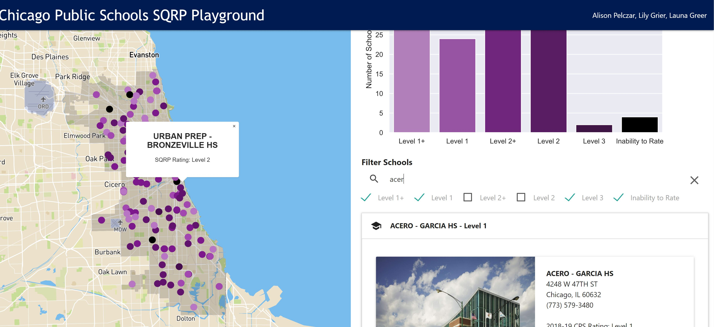

## CAPP 30122 Final Project: Chicago Public Schools SQRP Playground
### Ali Pelczar, Lily Grier, and Launa Greer
 
#### A Django web application. Allows users to build a school quality rating policy (SQRP) for the Chicago Public Schools (CPS). Uses the model configuration to rate each high school in the district and then generate a bias score for the SQRP as a whole.  Data is visualized through a map, list of school records, and series of regression plots.

**Language Requirements:**  
Python-3.8.1

**Setup:**  
(1) Run the command `sh install.sh` from the project root to verify the
current edition of Python, create a new virtual environment, and install all
required packages in that virtual environment.

(2) To launch the Django web application, open a new terminal window from the
project root, enter the command `python3 manage.py runserver`, and then
navigate to your local host, `http://127.0.0.1:8000/`, in your web broswer of 
choice. The page usually takes 5-10 seconds to load due to the presence of a 
map and the dynamic creation of SVG plots through the matplotlib package. Future
iterations of this project would attempt to cut down on this load time.

(3) To optionally test the creation and population of the database tables, 
run the command `python3 -m core.clients.dbclient` from the project root.
It deletes the tables if they exist and then rebuilds them again using the 
`setup()` function in `dbclient.py`.

**Description:**  
Through the web interface, a user may adjust slider widgets to set the 
relative weights for each school indicator. (The page is loaded with the weights
utilized in the 2018-2019 school year.) If the user does not want to include an
input in the rating system, the user should leave that input’s weight as zero.

The backend program takes those inputs, generates a rating system based on those
inputs, and assigns each school a rating accordingly. If inputs are missing for
a particular school, the algorithm reassigns those weights to a different inputs
(for details about this reassignment, see the “Reassignment Logic” section of
the Appendix). Finally, the backend calculates a bias score for the user's SQRP
model, which communicates how well schools’ scores align with the 
demographics of their student bodies. The interface returns the bias score for 
the specified policy along with individual ratings for each of the schools and a
series of three regression plots.