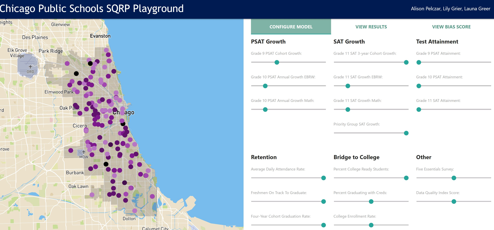
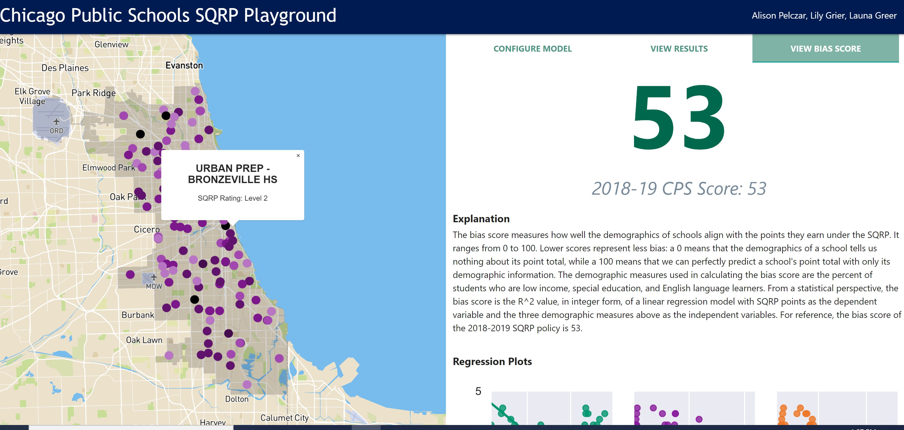

## CAPP 30122 Final Project: Chicago Public Schools SQRP Playground
### Ali Pelczar, Lily Grier, and Launa Greer
 
#### A Django web application allowing users to build a school quality rating policy (SQRP) model for the Chicago Public Schools (CPS). Uses the model configuration to rate each high school in the district and then generate a bias score for the SQRP as a whole.  Data is visualized through a map, list of school records, and series of regression plots.

**Documentation:**  
[Project Overview](apelczar-launagreer-lilygrier.pdf)  
[Bias Score Development](core/docs/bias_score_dev.pdf)

**Language Requirements:**  
Python-3.8.1

**Required Libraries:**  
asgiref==3.2.3  
astroid==2.3.3  
certifi==2019.11.28  
chardet==3.0.4  
colorama==0.4.3  
cycler==0.10.0  
Django==3.0.3  
idna==2.9  
isort==4.3.21  
joblib==0.14.1  
kiwisolver==1.1.0  
lazy-object-proxy==1.4.3  
matplotlib==3.2.0  
mccabe==0.6.1  
numpy==1.18.1  
pandas==1.0.1  
pylint==2.4.4  
pyparsing==2.4.6  
python-dateutil==2.8.1  
pytz==2019.3  
requests==2.23.0  
scikit-learn==0.22.2.post1  
scipy==1.4.1  
seaborn==0.10.0  
six==1.14.0  
sklearn==0.0  
sqlparse==0.3.0  
urllib3==1.25.8  
wrapt==1.11.2  
xlrd==1.2.0

**VM Setup:**  
*Note: For optimal performance, it is recommended to run the project outside
the VM, through an IDE like Visual Studio Code or PyCharm.*

(1) Ensure that Python-3.8.1 has been installed in the 'usr/local/bin' folder.
(Other locations can be used, but the script in the next step will have to be
modified accordingly.) If building Python [on Ubuntu from source](https://linuxize.com/post/how-to-install-python-3-7-on-ubuntu-18-04/),
the package 'libsqlite3-dev' must be installed first with `apt-get install libsqlite3-dev`.

(2) Run the command `bash install.sh` from the project root. The script verifies the
current installation of Python; creates a new virtual environment, 'env'; and
then installs all required packages in that environment using the requirements.txt file.

(3) Activate the virtual environment with the command `source env/bin/activate`.
To deactivate it, type `deactivate`.

(4) Launch the Django web application from the project root with the
command `python3 manage.py runserver`. Once the server is running,
navigate to your local webhost (e.g., `http://127.0.0.1:8000/`) in your browser of 
choice. The page usually takes 5-10 seconds to load due to the presence of a 
map and the dynamic creation of SVG plots through the matplotlib package. Future
iterations of this project would attempt to cut down this load time. There is 
also a bug in Ubuntu in which the Django server throws an exception stating that 
the port is already in use. To resolve this error should it arise, kill the 
associated process with `sudo fuser -k 8000/tcp`. To stop the server at any 
time, press `Ctrl-C`.

(5) Optionally test the creation and population of the database tables by 
running the command `python3 -m core.clients.dbclient` from the project root.
It deletes the tables if they exist and then rebuilds them again using the 
`setup()` function in `dbclient.py`.

**Description:**  
In the web interface, a user may adjust slider widgets to set the 
relative weights for each school indicator. (The page is initialized with the
weights from the 2018-2019 school year.) If the user does not want to include an
input in the rating system, the user should leave that input’s weight as zero.

The backend program takes those inputs, generates a rating system based on those
inputs, and assigns each school a rating accordingly. If inputs are missing for
a particular school, the algorithm reassigns those weights to a different inputs
(for details about this reassignment, see the “Reassignment Logic” section of
the Appendix in the project documentation). Finally, the backend calculates 
a bias score for the user's SQRP model, which communicates how well schools’ 
scores align with the demographics of their student bodies. The interface 
returns the bias score for the specified policy along with individual ratings 
for each of the schools and a series of three regression plots.